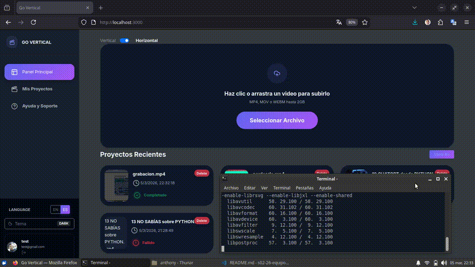

# 🎬 Go Vertical

## Problemática

Al convertir videos **horizontales a formato vertical**, suele perderse información importante de la imagen. Además, generar shorts de forma manual consume tiempo y no es el core del negocio para **startups, pymes y emprendedores**.

## 💡 Solución

Nuestra plataforma permite generar automáticamente shorts verticales a partir de videos horizontales largos.

El sistema:

- Recibe un video horizontal como entrada
- Permite definir fragmentos de hasta 60 segundos
- Recorta el contenido seleccionado
- Adapta el video al formato vertical (9:16)
- Ofrece dos tipos de formato vertical:
  - Vertical recortado (ajustando el encuadre al centro)
  - Vertical con video horizontal centrado, agregando márgenes superiores e inferiores (letterbox)

**Genera shorts listos para publicar en redes sociales**

> De esta manera, se agiliza el proceso de creación de contenido para plataformas como Instagram Reels, TikTok y YouTube Shorts, reduciendo el tiempo de edición y permitiendo al usuario elegir el formato que mejor se adapte a su estrategia de publicación.

Nuestra plataforma permite generar automáticamente shorts verticales a partir de videos horizontales largos.

## 🚀 Demo

                              📸 Vista previa del funcionamiento:

---

## ⚙️ Flujo de Funcionamiento

1️⃣ El usuario sube un video horizontal a la plataforma  
2️⃣ El backend procesa el archivo en segundo plano  
3️⃣ Se generan automáticamente fragmentos optimizados en formato vertical (9:16)  
4️⃣ Los shorts quedan listos para descargar o publicar en redes sociales

---

## 🛠️ Tecnologías Utilizadas

### 🎨 Frontend

---

### ⚙️ Backend

---

### 🐳 DevOps & Procesamiento

---

### 🛠️ Herramientas

---

## 👥 Equipo

Proyecto desarrollado por:

|  |  |  |
| :-------------------------------------------------------: | :-----------------------------------------------------: | :----------------------------------------------------: |
|                    **Camilo Martinez**                    |                 **Anabella Ventavoli**                  |                   **Alicia Aranda**                    |
|                    Frontend Developer                     |                   Frontend Developer                    |                   Frontend Developer                   |

 

|  |  |  |
| :------------------------------------------------: | :----------------------------------------------------: | :---------------------------------------------: |
|                   **Max Rodas**                    |                   **Anthony Erazo**                    |                **Anthony Bañon**                |
|                 Backend Developer                  |                   Backend Developer                    |                Backend Developer                |

## 

## 📦 Documentación Técnica

- 🎨 Frontend → [Frontend README](Frontend/README.md)
- ⚙️ Backend → [Backend README](Backend/README.md)

## 📄 Licencia

Este proyecto se desarrolla con fines educativos y de demostración profesional.  
Distribuido bajo la licencia [GNU GPL v3](LICENSE).
